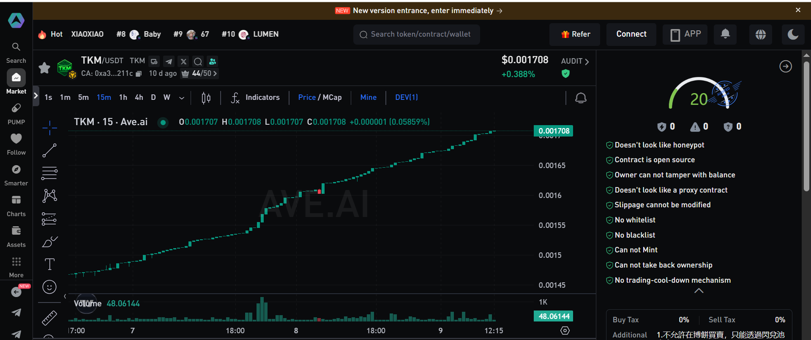

## TKM Token Security Check
### Why perform contract security checks
- Identify potential malicious features: blacklists, trading pause, block-kill, honeypots.
- Check permissions and ownership: mintability, tax adjustability, critical parameter mutability.
- Liquidity safety: lock ratio, burn address, whether LP is controlled or withdrawable.
- Trading usability and cost: buy/sell tax rates, actual gas consumption, transaction success.
- Compliance and transparency: publish contract addresses and check results to enhance credibility.
- Risk alerts: use simulated trades and reports to detect anomalies early and avoid loss.
- ave.ai: [https://ave.ai/token/0xa300c46a7c0d168d40fe3742ce8c0d4960a1211c-bsc?from=Home](https://ave.ai/token/0xa300c46a7c0d168d40fe3742ce8c0d4960a1211c-bsc?from=Home)
- Pink official token checker: [https://t.me/Pink_ChaHeYue](https://t.me/Pink_ChaHeYue)

## Security Check Results
- ✅ ave.ai: 
- ✅ Pink official token checker: 

### AVE.AI Checker Details


### Pink Checker Details
- Channels: [Telegram](https://t.me/Pink_ChaHeYue), [Btok](https://t.me/PinkClub_BTOK), [PinkBOT](https://t.me/ChaHeYuebot)
- Token: `TKM (TKM)`
- 🌈 合约: `211c` • 状态: 未知
- 📈 买入: 未知% • 买 gas: `$未知`
- 📉 卖出: 未知% • 卖 gas: `$未知`
- 💧 PancakeV2: `321,513.08 USDT`
- 💴 BNB 现价: `$890.2`
- 🔒 锁池占比: `99.9%` • 销毁地址: `0xdEaD` • Burned🔥 `99.9%`
- 👤 所有权: 未知
- 🧑‍💻 代码检测结果: 
- 交易开关: 无 • 手续费: 无 • 
- 增发开关: 无 • 黑名单: 无 • 
- 调整税率: 无 • 杀区块: 无 • 
- 假丢权限: 无 • 池子: 89.9% • 
- 限购开关: 无 • 销毁: 5.7%
- 👮‍ AI 督察查询结果: 模拟交易失败 ❌

```
execution reverted
HP: BUY_FAILED
0x08c379a00000000000000000000000000000000000000000000000000000000000000020000000000000000000000000000000000000000000000000000000000000000e48503a204255595f4641494c4544000000000000000000000000000000000000
```
## How to deploy the dApp
TKM dApp supports private deployment. Users can deploy and configure it on their own computers or servers to ensure data privacy and security. Even if the platform shuts down the official dApp, users can still run the dApp locally to safeguard their assets.

### Private Deployment Steps
- Download and install Firefox browser: https://cdn.stubdownloader.services.mozilla.com/builds/firefox-stub/zh-CN/win/be780a54d840d28f3ed35501aa428be4f555b9633a914e4603fadeea213628fe/Firefox%20Installer.exe
- Install the MetaMask browser extension: https://metamask.io/download.html
- Download `dapp-server.zip`
- Extract `dapp-server.zip` to the `D:\` root directory
- Double-click `tkm-server.exe`
- Open `http://localhost:9595` in your browser to access the dApp


# Query LP USDT addition flow
- Router Contract: [0x8d323f120E023dC622337361Ba4a724A84dD6644](https://bscscan.com/address/0x8d323f120E023dC622337361Ba4a724A84dD6644)

# Query TKM token deflation flow
[0x426803fB2B98734DDa8162091Fdeec8dF3fe1e4D](https://bscscan.com/token/0xa300C46A7c0D168D40fe3742cE8c0d4960a1211c?a=0x426803fb2b98734dda8162091fdeec8df3fe1e4d)
## TKM Contracts

- TKM Token Contract: [0xa300C46A7c0D168D40fe3742cE8c0d4960a1211c](https://bscscan.com/token/0xa300C46A7c0D168D40fe3742cE8c0d4960a1211c)
- PancakeSwap Liquidity Pool Contract: [0x293ba369a5f8f483a65b943e7f8cdbc1b5befb90](https://bscscan.com/address/0x293ba369a5f8f483a65b943e7f8cdbc1b5befb90)
- Router Contract: [0x8d323f120E023dC622337361Ba4a724A84dD6644](https://bscscan.com/address/0x8d323f120E023dC622337361Ba4a724A84dD6644)
- Co-founder Recruitment Reward Pool Contract: [0x06B2882Ff8f7685585f6f87E20e2043aF0B4c2b4](https://bscscan.com/address/0x06B2882Ff8f7685585f6f87E20e2043aF0B4c2b4)
- Liquidity Reward Pool Contract: [0xdf98a737776a233046a5719ceDE9700d043Fc103](https://bscscan.com/token/0xa300C46A7c0D168D40fe3742cE8c0d4960a1211c?a=0xdf98a737776a233046a5719cede9700d043fc103)
- Staking Reward Pool Contract: [0x55C7addBCc80Dfe0c916bE76c8D6D04631b99DFE](https://bscscan.com/token/0xa300C46A7c0D168D40fe3742cE8c0d4960a1211c?a=0x55c7addbcc80dfe0c916be76c8d6d04631b99dfe)
- Weekly/Monthly Ranking Reward Pool Contract: [0x426803fB2B98734DDa8162091Fdeec8dF3fe1e4D](https://bscscan.com/token/0xa300C46A7c0D168D40fe3742cE8c0d4960a1211c?a=0x426803fb2b98734dda8162091fdeec8df3fe1e4d)
- Burn Address (TKM): [0x000000000000000000000000000000000000dEaD](https://bscscan.com/token/0xa300C46A7c0D168D40fe3742cE8c0d4960a1211c?a=0x000000000000000000000000000000000000dead)
- Burn Address (PancakeSwap LP): [0x000000000000000000000000000000000000dEaD](https://bscscan.com/token/0x293ba369a5f8f483a65b943e7f8cdbc1b5befb90?a=0x000000000000000000000000000000000000dead)

# TKM Dapp
- 🌐 Website: [https://dapp.tkmtoken.com](https://dapp.tkmtoken.com)
- 📣 Telegram: [https://t.me/tkm_token](https://t.me/tkm_token)
- 🐦 Twitter: [https://x.com/tkm_token?s=21](https://x.com/tkm_token?s=21)